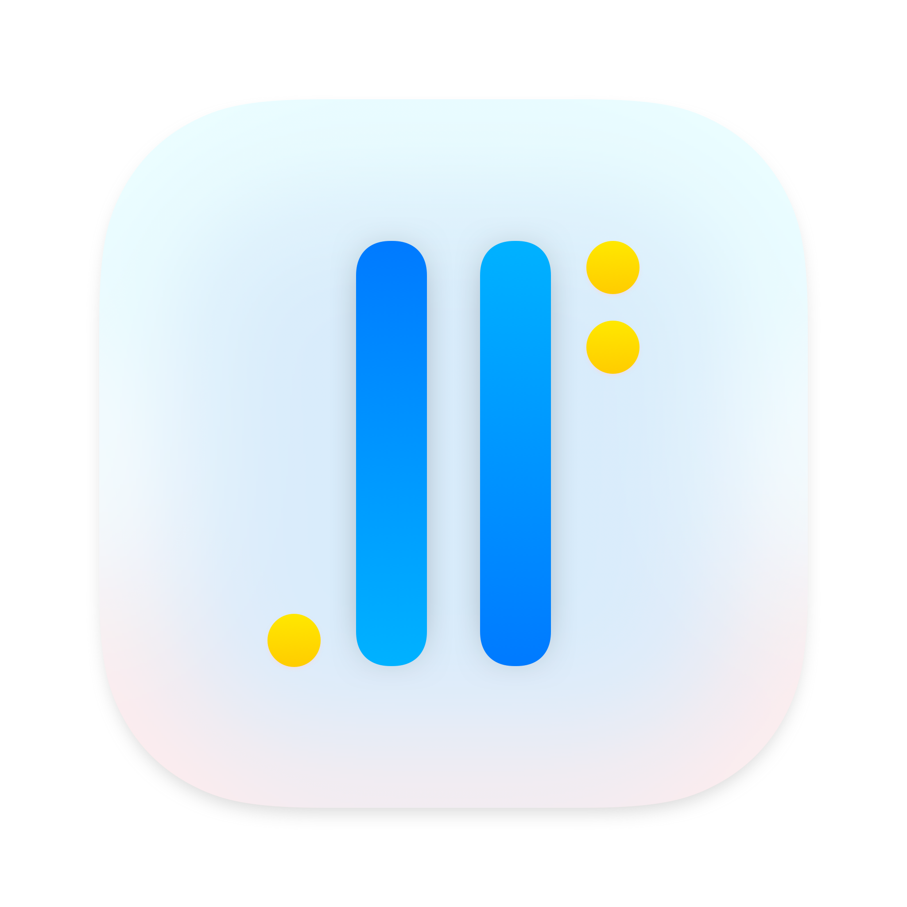
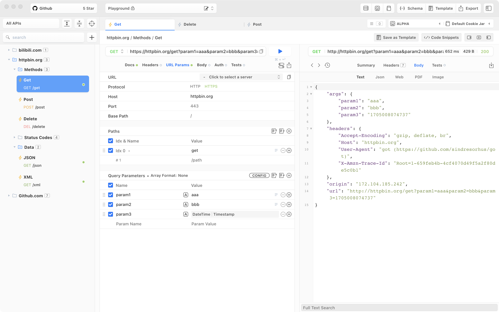

  

# Gotcha Rest Client

Gotcha is an open-source, cross-platform API client for API design and test.

Gotcha 是一个开源且跨平台的 API 设计和测试工具。

### Features

* No cloud service, no account required, **ALL data saved in the local indexedDB**
* Parameterized URL editor, enabling easy modification of all URL parameters through a form.
* Convenient use of dynamic variables through the right-click menu, including environment variables, date-time, and
  references to other interfaces, among various types.
* On-the-fly switching and modification of cookies, supporting the simultaneous use of multiple sets of cookies.
* Visual JSON editor.
* Save frequently used requests as request templates.

### 功能特色

* 无需登录注册，所有数据均存放在本地数据库(indexedDB)当中
* 完全可视化的 API 设计功能，自由编辑请求和响应，支持 Json Schema 格式，支持大多数 OpenAPI 标准
* 参数化 URL 编辑器，所有 URL 参数都可以通过表单形式轻松修改
* 通过右键菜单轻松使用动态变量，包括环境变量，日期时间，引用其它接口等多种类型
* 随时切换，修改 Cookie，支持同时使用多套 Cookie
* 可视化 JSON 编辑器
* 保存常用请求到请求模板

### Support Gotcha

* Star the project
* Share with others

### 支持该项目

Gotcha Rest Client 是完全免费的，你可以下载我开发的这些 APP 已支持该项目

[App Store](https://apps.apple.com/cn/app/id6450109182)

### Get Started

Download latest version from https://github.com/WhiteCosmos/Gotcha-Rest-Client/releases

The website is not ready yet...

### 开始使用

通过 Github 下载最新的 release 版本 https://github.com/WhiteCosmos/Gotcha-Rest-Client/releases

项目网站正在准备中

### Bugs and Feature Requests

Have a bug or a feature request? First, read the issue guidelines (Which not even exists) and search for existing and
closed issues. If your problem or idea is not addressed yet, please open a new issue.

请通过 Github Issue 反馈 BUG 或需求，详细描述 BUG 复现的步骤，最好带上截图

### Develop Gotcha

TODO

